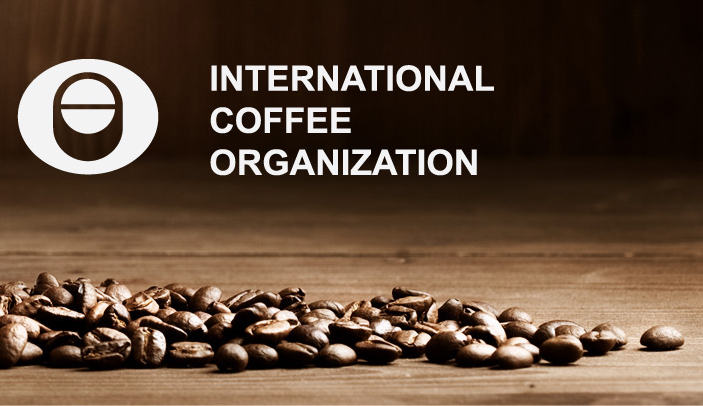
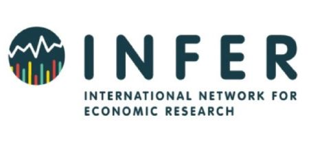

     <!--- Agrega lineas en blanco --->

# 1. Fellowship and Awards

     <!--- Agrega lineas en blanco --->

### 1.1 <i class="fas fa-trophy"></i> <a href="http://www.ico.org/documents/cy2018-19/ed-2295e-call-for-award-competition.pdf">  **ICO Award for Excellence in Coffee-Related Research**.</a><a href="http://www.ico.org/"> International Coffee Organization (ICO)</a>.Jun 2019.

+ This Award aims to promote high-quality research on emerging issues in the global coffee sector.
+ __Paper:__ Access to High Quality Coffee Markets: Possible for All?”.

     <!--- Agrega lineas en blanco --->

### 1.2 <i class="fas fa-trophy"></i> <a href="https://minciencias.gov.co/convocatorias/oportunidades-formacion/convocatoria-doctorados-nacionales-2016">**Doctoral Scholarship**</a>. COLCIENCIAS</a>.Jun 2017- Jun 2020. 

+ The Colombian department of Science and Technology offers this scholarship to support Colombians in their doctoral studies.

     <!--- Agrega lineas en blanco --->

# 2. Conference Presentation

     <!--- Agrega lineas en blanco --->

### 2.1 **INFER Workshop on Economic Development thinking the environment**. May 2019, Coimbra, Portugal.

     <!--- Agrega lineas en blanco --->

# 3. Others

### 3.1  Coursera

* <i class="fas fa-medal"></i><a href="https://alexanderburitica.github.io/cursera/Coursera_ODS.jpg"> **Los Objetivos de Desarrollo Sostenible para las empresas** </a>.

* <i class="fas fa-medal"></i><a href="https://alexanderburitica.github.io/cursera/Coursera_Big.jpg"> **Introduction to Big Data** </a>.

* <i class="fas fa-medal"></i><a href="https://alexanderburitica.github.io/cursera/Coursera_Complex.jpg"> **Combining and Analyzing Complex Data** </a>.

* <i class="fas fa-medal"></i><a href="https://alexanderburitica.github.io/cursera/Coursera_Reprod.jpg"> **Reproducible Templates for Analysis and Dissemination** </a>.

     <!--- Agrega lineas en blanco --->

     <!--- Agrega lineas en blanco --->
